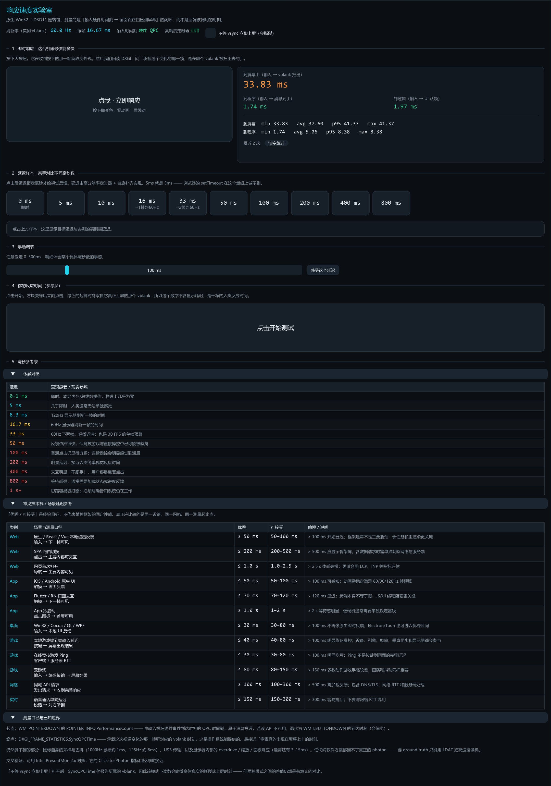

<div align="center">

# 响应速度实验室 · Response Speed Lab

**亲手感受每一毫秒。** 一个 Windows 原生小工具，测量的是**输入硬件时间戳 → 画面真正扫出到屏幕**的完整闭环。

[](https://github.com/stv1024/response-speed-lab/actions/workflows/build.yml)
[](LICENSE)


[English](README.md) · 简体中文



</div>

---

## 为什么要做这个

常见的「延迟演示」网页测错了东西。它们计时到 `requestAnimationFrame` 回调 —— 而这个回调跑在**绘制与合成之前** —— 然后管它叫「到屏幕的时间」。它不是。

这个工具测的是真实闭环：

**硬件输入时间戳 → 消息分派 → UI 逻辑 → 提交帧 → vblank 扫出**

| | 常见网页版 | 本工具 |
|---|---|---|
| **测量终点** | `requestAnimationFrame` 回调 —— 跑在绘制/合成**之前**，系统性偏小 | `DXGI_FRAME_STATISTICS::SyncQPCTime` —— 承载这次变化的那个真实 vblank |
| **延迟样本精度** | `setTimeout(5)` 实际 5–20ms，`5 / 10 / 16ms` 三个样本**根本无法区分** | 高分辨率定时器 + QPC 自旋，短目标本帧内兑现 |
| **计时精度** | 无跨源隔离时 `performance.now()` 被量化到 ~100µs（Firefox 更粗） | QPC，约 0.1µs 分辨率 |

## 功能

1. **即时响应** —— 大按钮，按下即变色，零动画零缓动。给出三个互不混淆的口径：
   - **到程序** —— 输入 → 消息到手
   - **到逻辑** —— 输入 → UI 认领这次按下
   - **到屏幕** —— 输入 → vblank 扫出

   附最近 100 次的 min / avg / p95 / max。

2. **延迟样本** —— 十个按钮：`0 / 5 / 10 / 16 / 33 / 50 / 100 / 200 / 400 / 800 ms`，横向对比手感。≤20ms 的目标**在同一帧内**兑现，不会让 5ms 的样本悄悄多花 16.7ms。

3. **手动调节** —— 0–500ms 滑块，任意设定一个具体值。

4. **反应时间** —— 起算时刻取自绿色**真正上屏的那个 vblank**，所以这个数字不含显示延迟，是干净的人类反应时间。

5. **参考表** —— 体感对照，加上 Web / 移动端 / 桌面 / 游戏 / 网络各场景的经验目标区间。三种测量口径（「输入到画面」「网络 RTT」「操作到内容可用」）明确区分，不可互相替代或相加。

## 实测数据

60Hz，窗口模式，各 15+ 次采样。多次独立干净构建均可复现：

| 口径 | min | avg | max |
|---|---:|---:|---:|
| 到程序（输入→消息到手） | 0.10 | 5.4 | 16.1 |
| 到屏幕，**对齐 vsync** | **33.78** | 42.1 | 49.2 |
| 到屏幕，**开启撕裂** | **17.76** | 35.4 | 49.2 |

**开启撕裂省下整整一帧（33.78 → 17.76ms）。** 这就是「等下一个 vblank」的真实价格 —— 也是这个工具最值得你亲手按一遍验证的一条。

窗口模式下约 33ms（两帧）的地板来自 DWM 桌面合成。无边框全屏命中 independent flip 可以更低。

## 技术栈

**C++17 · 纯 Win32 · Direct3D 11 / DXGI 翻转模型 · Dear ImGui** —— 静态链接，单个约 670KB 的 exe，无运行时依赖。

- **输入端** —— `EnableMouseInPointer` → `WM_POINTERDOWN` → `POINTER_INFO.PerformanceCount`，这是输入栈在硬件事件到达时打的 QPC 时间戳，早于消息投递。
- **输出端** —— `FLIP_DISCARD` 翻转链 + `SetMaximumFrameLatency(1)` + 可等待对象；`GetFrameStatistics()` 回读该帧真正扫出的时刻。
- **撕裂开关** —— `ALLOW_TEARING` + `Present(0)`，不等 vsync 立刻扫出。

<details>
<summary><b>为什么不用 Web / C#·WPF / wgpu / Electron？</b></summary>

- **浏览器** —— 拿不到 `SyncQPCTime`。`rAF` 在合成前触发，`setTimeout` 分辨不了个位数毫秒，时钟还被刻意钝化。此外多一跳浏览器进程 → 渲染进程 IPC，也绕不开 DWM。
- **C# / WPF / WinUI** —— GC 停顿。一个测延迟的工具自己有不可控的 STW 暂停，结论没有可信度。NativeAOT + 零分配能救，但为此付出的约束比写 C++ 还多。
- **Rust + wgpu** —— Rust 本身没问题，但 wgpu 把 `GetFrameStatistics`、撕裂控制、可等待交换链这些**恰恰最需要的东西**抽象掉了。Rust 配 `windows-rs` 直接调 DXGI 是等价可行的。
- **Electron / Tauri** —— 继承浏览器全部问题，还多一层。
- **Qt / WinUI 3** —— 框架自己的渲染循环和输入队列不可控，测量口径会被污染。

</details>

## 构建与运行

**构建**：需要 Visual Studio 2026 (18) 的 C++ 工作负载 + Windows SDK。

```bat
build.bat
```

或手动：

```bat
cmake -S . -B build -G "Visual Studio 18 2026" -A x64
cmake --build build --config Release --parallel
```

Dear ImGui v1.92.1 已 vendor 在 `third_party/imgui`，无需拉取依赖。

构建产物是 `bin\ResponseSpeedLab.exe`，双击运行，`Esc` 退出。

不想自己编译？每次推送到 `main` 都会把编译好的 exe 作为
[workflow artifact](https://github.com/stv1024/response-speed-lab/actions/workflows/build.yml)
上传（登录 GitHub 后可下载）。

## 测量口径与已知边界

**任何纯软件方案都测不到的部分：**

- 鼠标自身的采样与去抖 —— 1000Hz 鼠标约 1ms，125Hz 约 8ms
- USB 传输
- 显示器内部的 overdrive / 缩放 / 面板响应 —— 通常还有 3–15ms

真正的 ground truth（实际光子）只能用 NVIDIA LDAT 或高速摄像机。这一点写进了程序自己的「测量口径与已知边界」面板，避免 `0.10ms` 被误读成端到端。

**其他注意事项：**

- 开启撕裂后，部分显示路径下 DXGI 会停止上报帧统计。此时程序显示**「不可测」**，而不是给一个旧值糊弄。
- 交叉验证建议用 [Intel PresentMon 2.x](https://game.intel.com/us/stories/intel-presentmon/)，它的 Click-to-Photon 指标口径与此接近。
- 程序会设置 `timeBeginPeriod(1)` 和 `HIGH_PRIORITY_CLASS`，减少调度抖动对测量的污染。

## 目录结构

```
response-speed-lab/
├── src/
│   ├── main.cpp        # Win32 窗口、帧循环、消息泵
│   ├── renderer.cpp    # D3D11 + DXGI 翻转链、帧统计回读
│   ├── app.cpp         # 各面板、探针生命周期、统计
│   ├── timing.h        # QPC 基元、高精度等待
│   └── fonts.h         # 字体与配色
├── third_party/imgui/  # Dear ImGui v1.92.1
├── bin/                # 构建产物
├── build.bat
└── legacy-web/         # 最初的单文件 HTML 版（已归档）
```

## 许可

[MIT](LICENSE) © stv1024

Dear ImGui © Omar Cornut，同为 MIT 许可。
